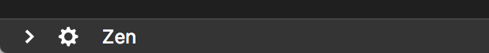
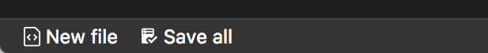
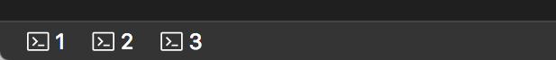
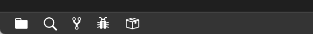
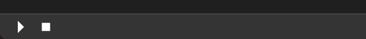
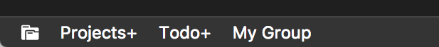
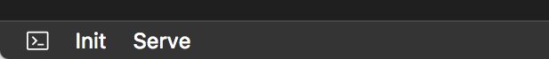

# Commands

<p align="center">
  
</p>

Trigger arbitrary commands from the statusbar. Supports passing arguments!

It comes packed with a lot of features:
  - **Supports passing arguments**: No other extension of this kind supports passing arguments to commands. This feature makes it quite powerful, for instance adding the ability to trigger custom terminal commands via [Terminals](https://marketplace.visualstudio.com/items?itemName=fabiospampinato.vscode-terminals), more about it below.
  - **Configuration based**: No need to create an extension just for adding some simple items to the statusbar, just edit the configuration.
  - **Global and local commands**: Define commands in your settings to make them global, define them in a local configuration file to make them project-specific.
  - **Configurable**: Many aspects of the statusbar items can be configured, including text, tooltip, color, position etc.
  - **Per language commands**: Show a particular statusbar item only if the currently opened file's language matches a provided regex.
  - **Per file commands**: Show a particular statusbar item only if the currently opened file's path matches a provided regex.
  - **Per workspace file**: Show a particular statusbar item only if a workspace file path matches a provided regex.

## Install

Follow the instructions in the [Marketplace](https://marketplace.visualstudio.com/items?itemName=fabiospampinato.vscode-commands), or run the following in the command palette:

```shell
ext install fabiospampinato.vscode-commands
```

## Usage

It adds 2 commands to the command palette:

```js
Commands: Edit Configuration // Open the local configuration file
Commands: Refresh // Force a refresh, must be called after editing the local configuration
```

## Configuration

Run the `Commands: Edit Configuration` command to create the local configuration file. If you want to define global commands simply add them to your Visual Studio Code settings under the key `commands.commands`.

The configuration is an object that looks like this:

```js
{
  "commands": [ // Array of commands
    { // An object describing a command, most entries are optional
      "alignment": "left", // Should the item be placed to the left or right?
      "priority": 0, // The priority of this item. Higher value means the item should be shown more to the left
      "color": "#FFCC00", // The foreground color for this item
      "text": "$(gear) Settings", // The text to show for the entry
      "tooltip": "Open User Settings", // The tooltip text when you hover over this item
      "command": "workbench.action.openGlobalSettings", // Command to execute
      "arguments": [1, 2, 3], // Arguments to pass to the command handler
      "filterLanguageRegex": "markdown", // Show only if current file's language matches this regex. Requires double escaping
      "filterFileRegex": ".*\\.ext", // Show only if the current file's path matches this regex. Requires double escaping
      "filterWorskspaceFileRegex": ".*\\.ext", // Show only if a workspace file path matches this regex. Requires double escaping
    }
  ]
}
```

## Examples

### Simple commands

- Add buttons for opening the command palette, the global settings and toggling zen mode.

```js
{
  "text": "$(chevron-right)",
  "command": "workbench.action.showCommands",
  "tooltip": "Show commands"
},
{
  "text": "$(gear)",
  "command": "workbench.action.openGlobalSettings",
  "tooltip": "Settings"
},
{
  "text": "Zen",
  "command": "workbench.action.toggleZenMode",
  "tooltip": "Toggle Zen mode"
}
```



- Add some file-related buttons: create a new untitled file and save all files.

```js
{
  "text": "$(file-code) New file",
  "command": "workbench.action.files.newUntitledFile",
  "tooltip": "New file"
},
{
  "text": "$(checklist) Save all",
  "command": "workbench.action.files.saveAll",
  "tooltip": "Save all files"
}
```



- Add a button for showing the Markdown preview to the side, only when a Markdown file is currently active.

```js
{
  "text": "$(markdown)",
  "command": "markdown.showPreviewToSide",
  "tooltip": "Open markdown preview",
  "filterFileRegex": ".*\\.md"
}
```


### Implementing existing extensions' functionality

- [Terminal Tabs](https://marketplace.visualstudio.com/items?itemName=Tyriar.terminal-tabs): Add buttons for easy switching to the N-th terminal instance.

```js
{
  "text": "$(terminal) 1",
  "command": "workbench.action.terminal.focusAtIndex1",
  "tooltip": "Focus to terminal #1"
},
{
  "text": "$(terminal) 2",
  "command": "workbench.action.terminal.focusAtIndex2",
  "tooltip": "Focus to terminal #2"
},
{
  "text": "$(terminal) 3",
  "command": "workbench.action.terminal.focusAtIndex3",
  "tooltip": "Focus to terminal #3"
}
```



- [Activitus Bar](https://marketplace.visualstudio.com/items?itemName=Gruntfuggly.activitusbar): Replace the activity bar with buttons in the statusbar.

```js
{
  "text": "$(file-directory)",
  "command": "workbench.view.explorer",
  "tooltip": "Explorer"
},
{
  "text": "$(search)",
  "command": "workbench.view.search",
  "tooltip": "Search"
},
{
  "text": "$(repo-forked)",
  "command": "workbench.view.scm",
  "tooltip": "Source Control"
},
{
  "text": "$(bug)",
  "command": "workbench.view.debug",
  "tooltip": "Debug"
},
{
  "text": "$(package)",
  "command": "workbench.view.extensions",
  "tooltip": "Extensions"
}
```



- [StatusBar Debugger](https://marketplace.visualstudio.com/items?itemName=fabiospampinato.vscode-statusbar-debugger): Replace the default floating debugger with some statusbar buttons. That extension is actually a bit more powerful than this, but if you don't need all it's functionalities the following configuration might be good enough.

```js
{
  "text": "$(triangle-right)",
  "command": "workbench.action.debug.start",
  "tooltip": "Start debugging"
},
{
  "text": "$(primitive-square)",
  "command": "workbench.action.debug.stop",
  "tooltip": "Stop debugging"
}
```



### Plays well with others

[Projects+](https://marketplace.visualstudio.com/items?itemName=fabiospampinato.vscode-projects-plus): Add some buttons for quickly switching between projects.

```js
{
  "text": "$(file-submodule)",
  "command": "projects.open",
  "tooltip": "Open a project"
},
{
  "text": "Projects+",
  "command": "projects.openByName",
  "arguments": ["vscode-projects-plus"],
  "tooltip": "Open Projects+"
},
{
  "text": "Todo+",
  "command": "projects.openByName",
  "arguments": ["vscode-todo-plus", true],
  "tooltip": "Open Todo+ in a new window"
},
{
  "text": "My Group",
  "command": "projects.openByName",
  "arguments": ["My Group", false, true],
  "tooltip": "Switch to the My Group"
}
```



[Todo+](https://marketplace.visualstudio.com/items?itemName=fabiospampinato.vscode-todo-plus): Add a button for opening the todo file, and if that is opened add a button for viewing all todos across your projects, using [Projects+ Todo+](https://marketplace.visualstudio.com/items?itemName=fabiospampinato.vscode-projects-plus-todo-plus).

```js
{
  "text": "$(check)",
  "command": "todo.open",
  "tooltip": "Open todo"
},
{
  "text": "$(checklist)",
  "command": "projects.todo",
  "tooltip": "Open global todo",
  "filterLanguageRegex": "todo"
}
```


[Terminals](https://marketplace.visualstudio.com/items?itemName=fabiospampinato.vscode-terminals): Trigger custom advanced terminal commands.

```js
{
  "text": "$(terminal)",
  "command": "terminals.runTerminal",
  "tooltip": "Run a terminal"
},
{
  "text": "Init",
  "command": "terminals.runTerminalByName",
  "arguments": ["init"],
  "tooltip": "Init the project"
},
{
  "text": "Serve",
  "command": "terminals.runTerminalByName",
  "arguments": ["serve"],
  "tooltip": "Serve the project"
}
```



## Hints

- **Icons**: [here](https://octicons.github.com/) you can browse a list of supported icons. If for instance you click the first icon, you'll get a page with `.octicon-alert` written in it, to get the string to use simply remove the `.octicon-` part, so in this case the icon name would be `alert`.
- **Live Refresh**: Even if you're crafting some local commands, it's advisable to start by adding them globally because every time you edit your global settings your commands will be automatically refreshed. Once you're done just move them to the local configuration file.

## Contributing

If you found a problem, or have a feature request, please open an [issue](https://github.com/fabiospampinato/vscode-commands/issues) about it.

If you want to make a pull request you can debug the extension using [Debug Launcher](https://marketplace.visualstudio.com/items?itemName=fabiospampinato.vscode-debug-launcher).

## License

MIT © Fabio Spampinato
